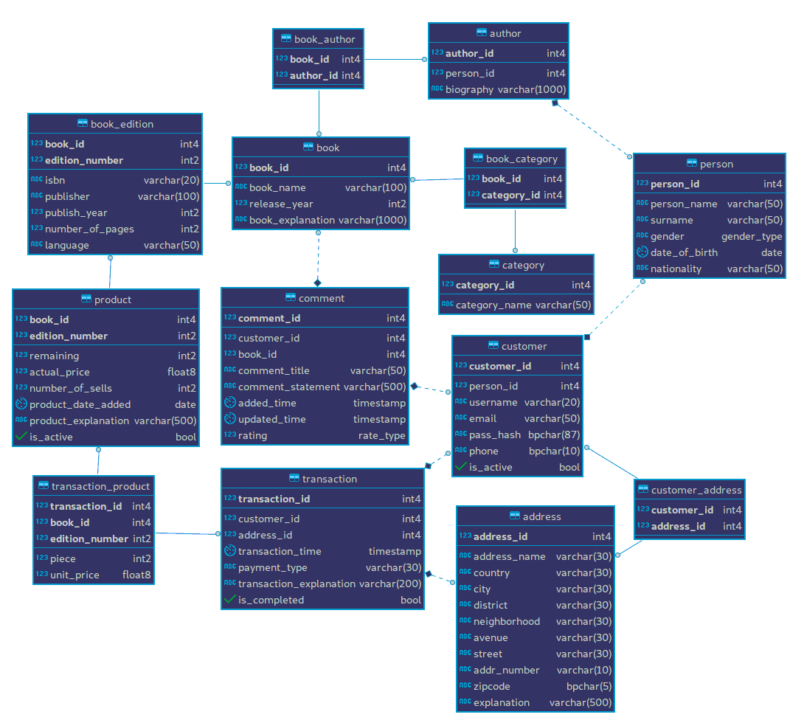

.. role:: sql(code)
   :language: sql
   :class: highlight

Developer Guide
===============

BeeBook is a book selling website which aims to provide an
user-friendly UI to its customers. They are two users of system.
The first one is customers and the second one is admin account.
Admin can add books, books' editions and their products, authors
etc. Customers can edit their information, they can add or edit
their addresses, and they can buy books.

Database Design
---------------

We have totally 14 tables:
 * 6 of them are main tables,
 * 4 of them are interconnection tables (which maps two tables to each other),
 * The rest of them are helper tables which completes the project, but not
   main tables (that have 5 non-key attributes).

    Entity Relationship Diagram

Code
----

Our tables' SQL statements are such followings:

.. literalinclude:: tables.sql
   :language: sql
   :linenos:
   :caption: **tables.sql** (file: ``tables.sql``)
   :name: tables
   :lines: 1-125

The detailed explanations of the tables will be covered
in the following sections.

.. toctree::

   baseClass
   member1
   member2
