Parts Implemented by Ahmed Yasin KUL
=====================================

Customer
--------

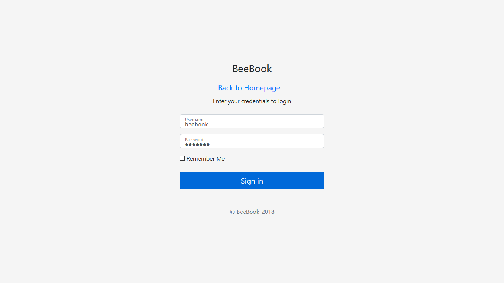

    Login page

Customer and admin can login to system from this page.

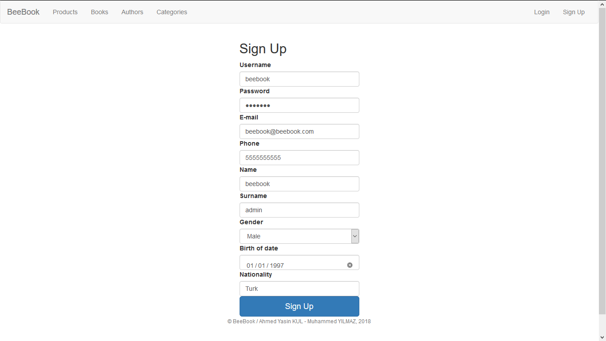

    Sign Up Page

Customer can sign up from this page.

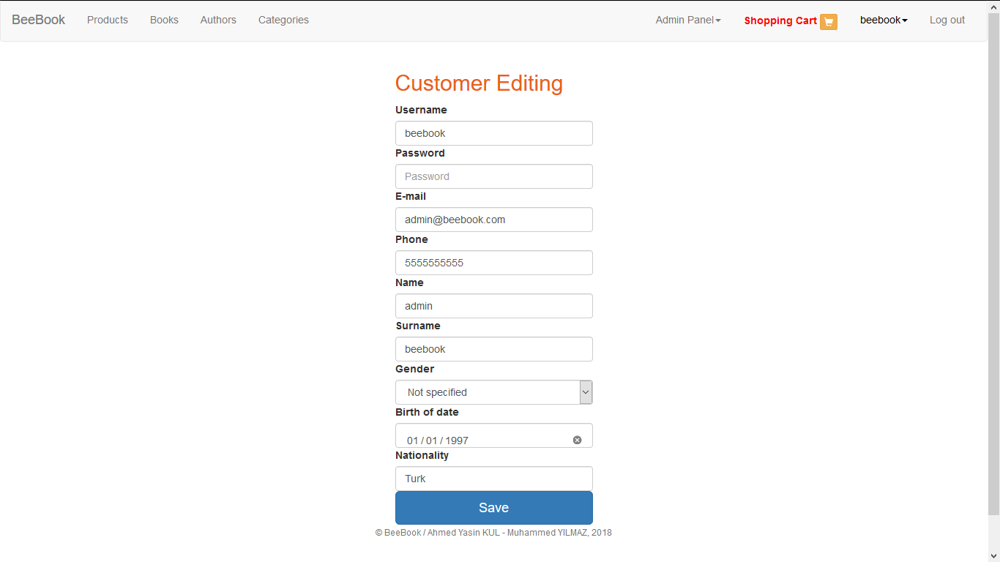

    Editing customer informations page

Customer can edits his information from this page.

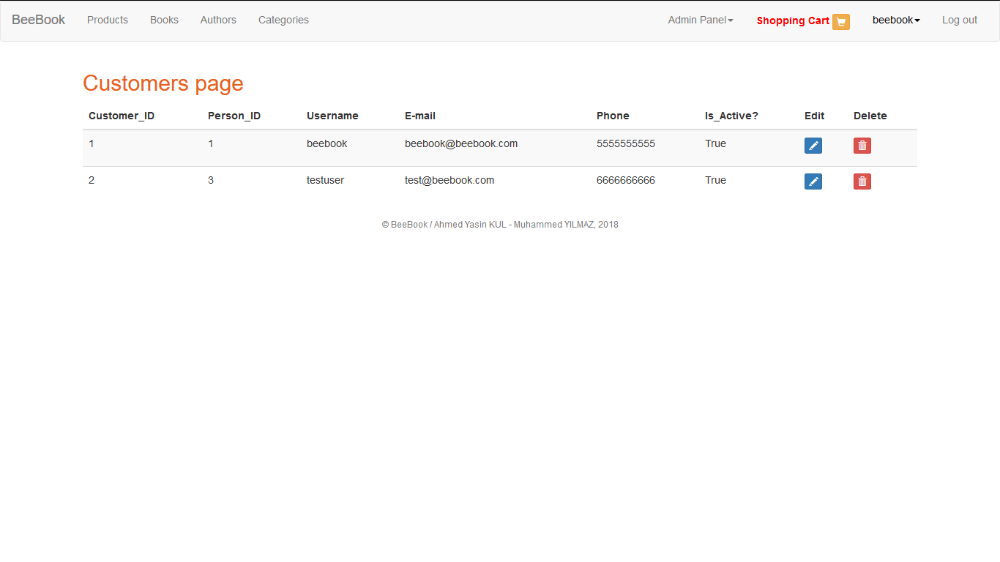

    Customers page for admin

Admin can shows all customers in this page and he can edits or
deletes from this page.

Admin
--------

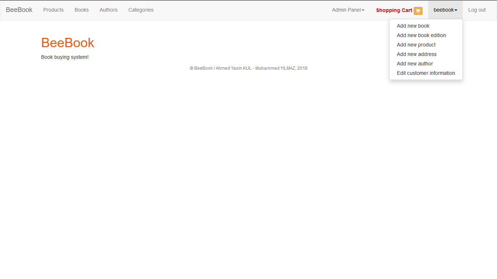

    Adding new object options for admin

Admin can add new book, book edition, product, address and author.

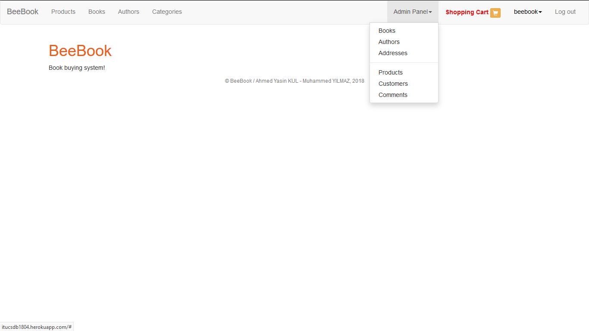

    Database tables list for admin

Admin can access database tables and he can edits or delete objects.

Author
------

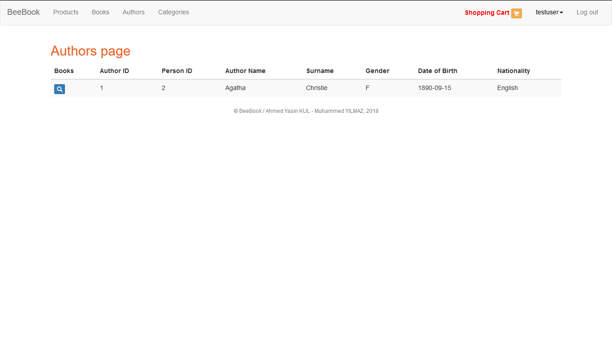

    Authors page for customer

Customer can monitors authors in this page.
All books of the author can monitored from search button.

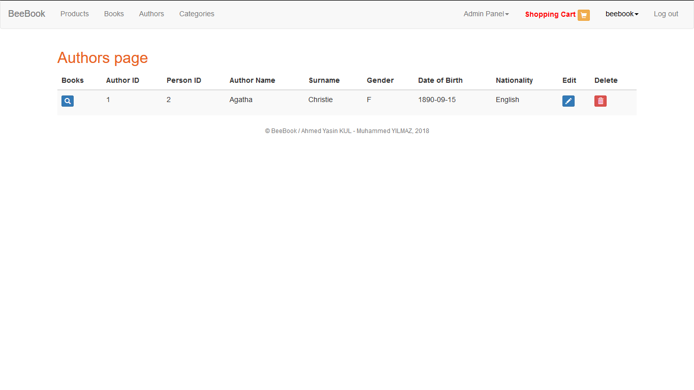

    Authors page for admin

Admin can edits or deletes authors in this page

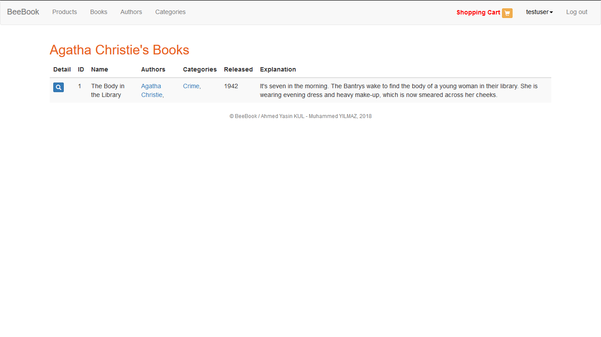

    Author's books page

All the books of an author are listed in this page.
Book edition of the book can showed from search button.
Also, books of the category or author can accessed from its name.

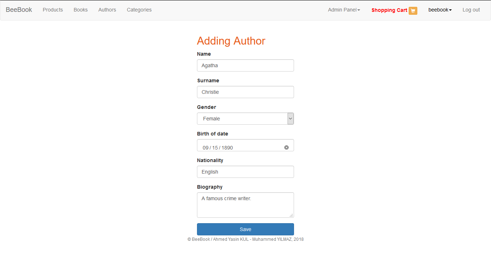

    Adding author page for admin

Admin can add new author from this page and also can edit
author from this page.

Address
-------

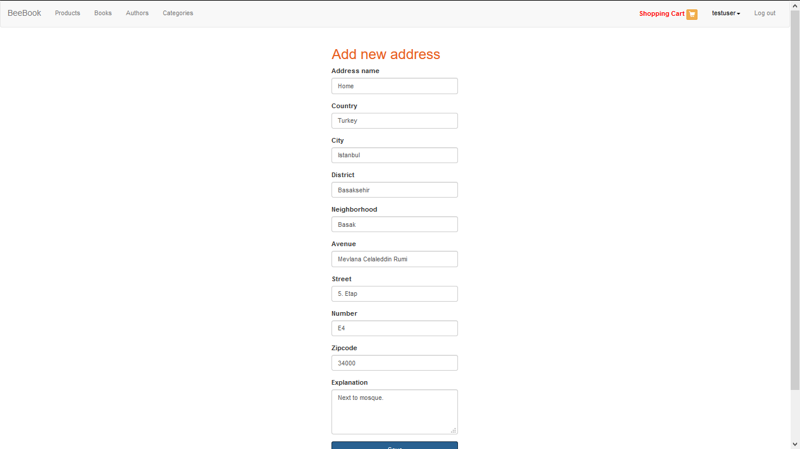

    Adding new address

Customer adds new address in this page.

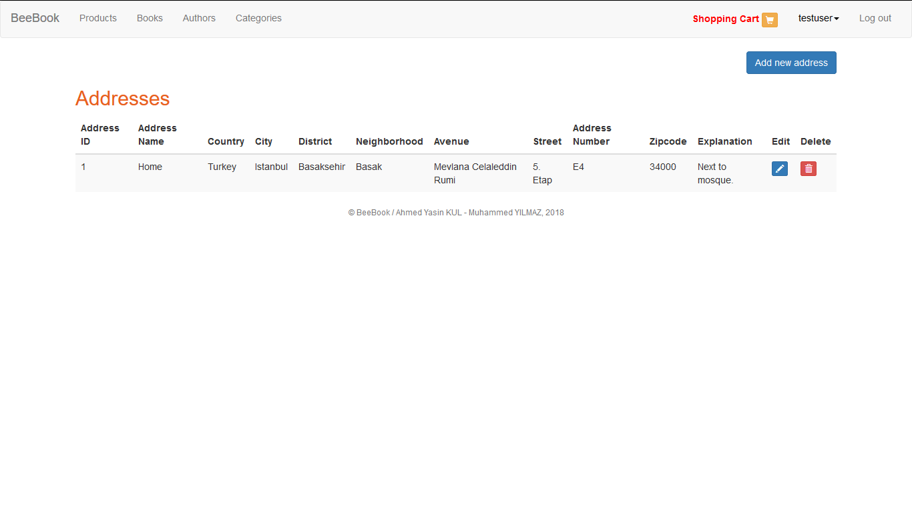

    Addresses page for customer

Customer can list his/her addresses from this page.

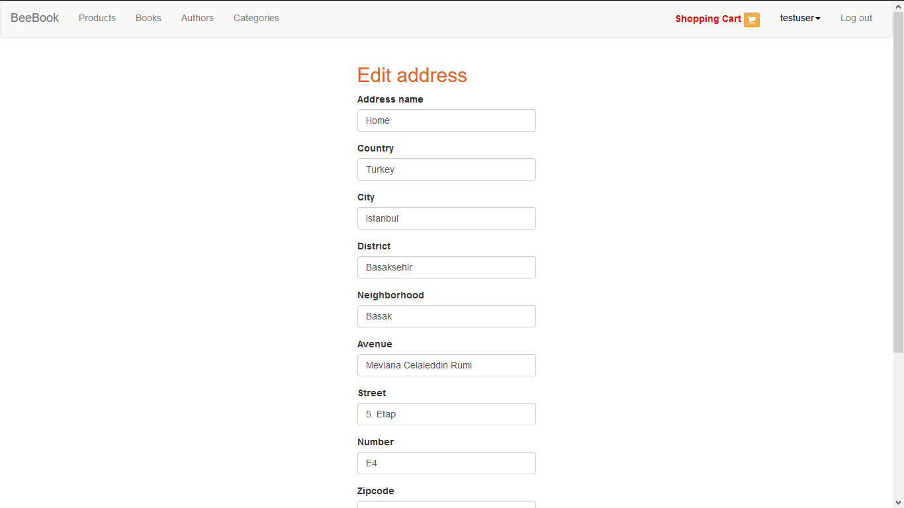

    Editing address page

Customer edits his address in this page.

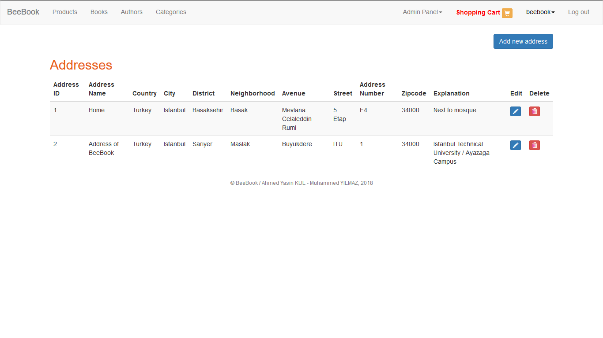

    Addresses page for admin

Admin can monitors all address in this page.

Category
--------

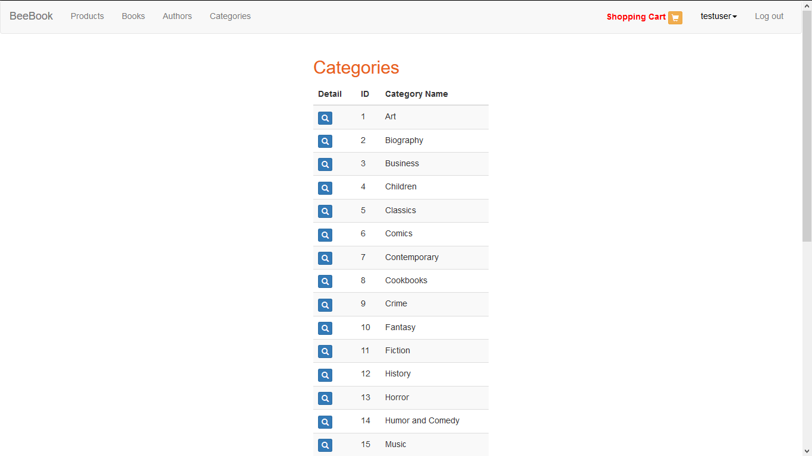

    Categories page

Customer can monitors all categories in this page.
All books of the category can monitored from search button.

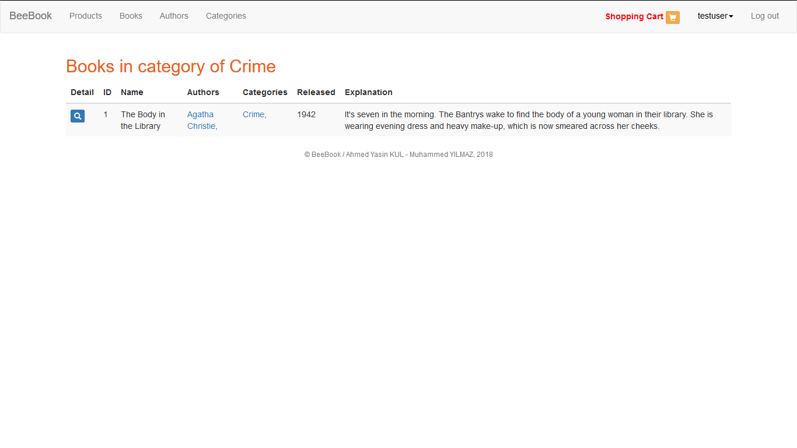

    Books of category page

Customer can monitors all books of the category in this page.
Book edition of the book can showed from search button.
Also books of the catogery or author can accessed from its name.
