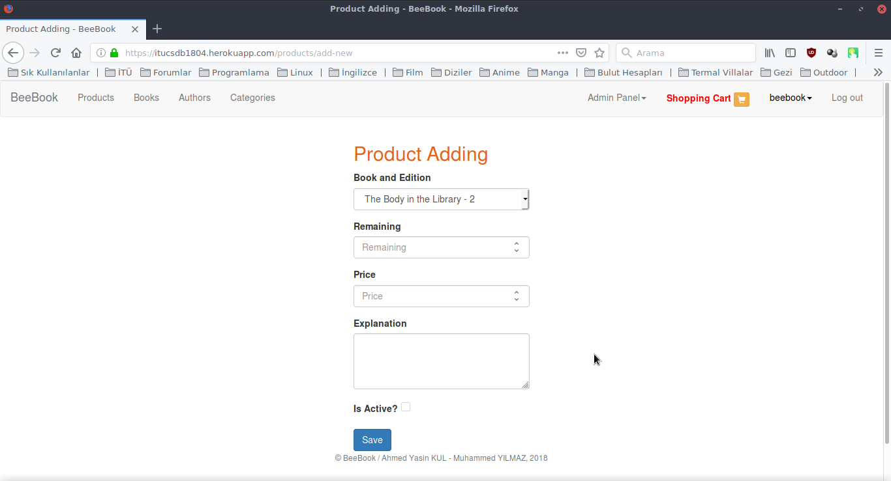

Parts Implemented by Muhammed YILMAZ
=====================================

Book
----

    Books page for customers
Books are showed in this page. 
Book edition of the book can showed from search button. 
Also books of the catogery or author can accessed from its name.

    Books page for admin
Admin can edits and deletes books from this page.

.. figure:: screenshots/book.png

    Book page for customers
All book editions of the books are showed in the book page. Product of 
the book edition can monitored from search button.

    Book adding page
Admin can adds new book with this page.

.. figure:: screenshots/admin_book_edit.png

    Book editing page
Admin can edits the book with this page.

Book Edition
------------

    Book edition adding page
Admin can adds new book edition with this page.

.. figure:: screenshots/admin_book_edition_edit.png

    Book editing page
Admin can edits the book edition with this page.

Comment
-------

.. figure:: screenshots/book_comments.png

    Comments bottom of book page
Comments list bottom the book page. 
Customer can edits or deletes his comments.
Admin can only deletes all comments but not deletes.

    Comment adding bottom of book page
Customer can adds new comment to the book.

    Comment editing page
Customer edits his comment with this page.

.. figure:: screenshots/admin_comments.png

    Comments page for admin
Only admin can accesses this page.
Admin monitores all comments and can deletes. 

Product
-------

.. figure:: screenshots/products_page.png

    Products page for customer
All active products are showed in this page.
The product page can been showed from search button.

.. figure:: screenshots/admin_products.png

    Products page for admin
Admin can edits or deletes products from this page.

    Product page
There are book informations, book edition informations, and product
informations in this page.

.. figure:: screenshots/user_product.png

    Product page for customer
Customers can add product to their shopping cart and edits buying 
number of the product. If there is not enough product, they cannot.

    Product adding page for admin
Admin can adds new product with this page.

.. figure:: screenshots/admin_product_edit.png

    Product editing page for admin
Admin can edits the product with this page.

Shopping Cart
-------------

    Shopping cart page for customer
There is shopping cart for all customers. 
Customers can show their shopping cart with this page.
When shopping is completed, confirm shopping from this page. 

.. figure:: screenshots/user_shopping_cart_next.png

    Complete shopping page
Before give order of shopping, giving address information and 
cash type are required. Customer can selects required informations.